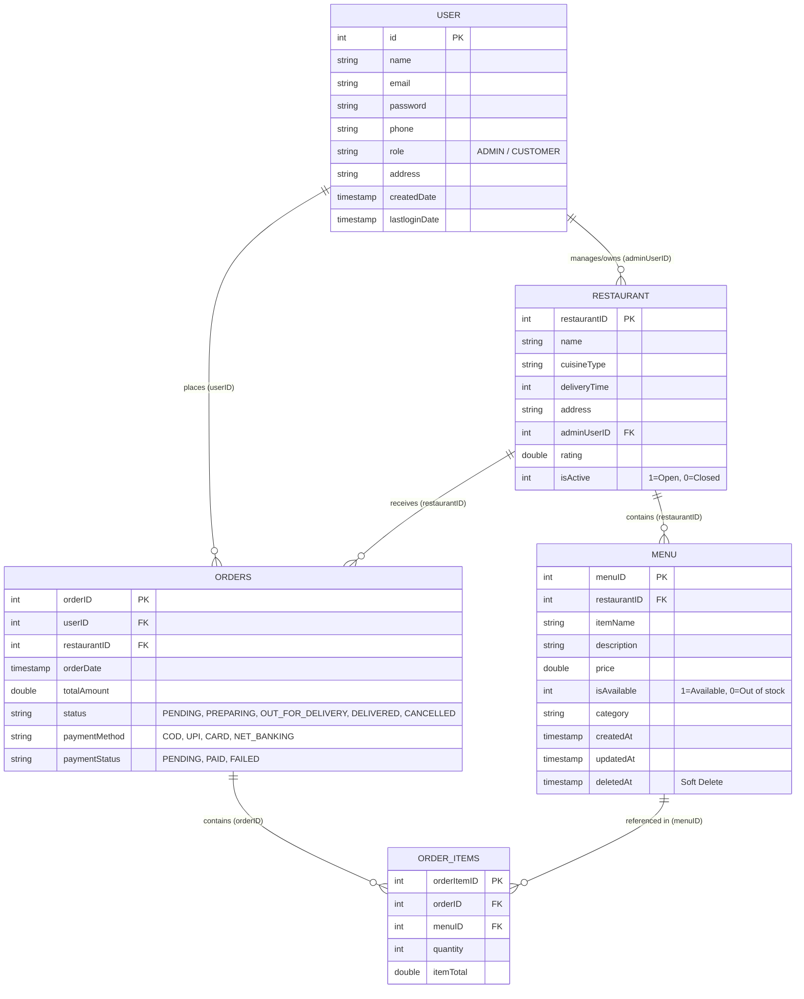
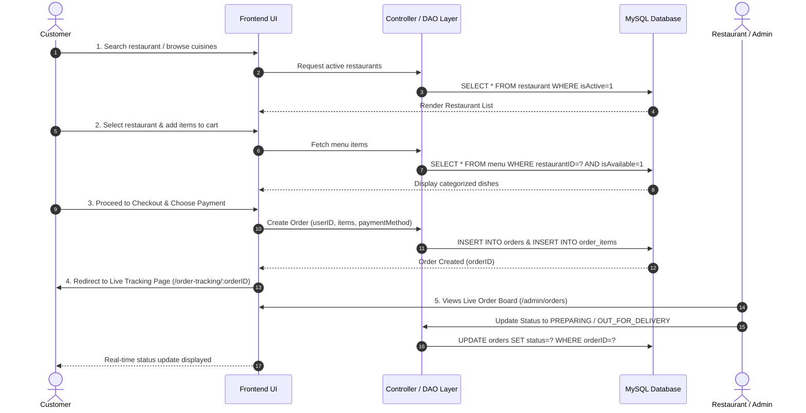

# FoodApp - Project Architecture Analysis & Frontend Specification

## 1. Project Context & Overview

**FoodApp** is a multi-tier Food Ordering & Delivery Application designed using the **DAO (Data Access Object) Design Pattern** in Java with direct **JDBC** connectivity to a MySQL database (`food_app`).

### Technology Stack
* **Language & Backend Core**: Java (JDBC with PreparedStatements)
* **Database**: MySQL (`food_app` database hosted on `localhost:3306`)
* **Driver**: `com.mysql.cj.jdbc.Driver` (`mysql-connector-j-9.2.0.jar`)
* **Architecture**: Model-DAO-DAOImpl layered architecture

---

## 2. Database Schema & DAO Mapping

---

## 3. Frontend Pages Specification

The frontend is structured into two main interfaces:
1. **Customer-Facing Application** (Browse, Customize, Cart, Checkout, Live Tracking, History)
2. **Admin & Restaurant Partner Portal** (Dashboard, Restaurant Settings, Menu Catalog, Live Kitchen Dispatch)

---

### A. Customer-Facing Pages

#### 1. Home / Landing Page (`/` or `/home`)
* **Purpose**: Primary entry point. Showcases hero search, cuisine categories, top-rated restaurants, and fast delivery options.
* **Database & DAO Connection**:
  * `RestaurantDAO.getAllRestaurants()` &rarr; Filters and displays active restaurants (`isActive == 1`) with rating, delivery time, and cuisine type.
* **Key UI Components**:
  * Global search bar (dish name or restaurant name).
  * Cuisine category filter pills (e.g., Pizza, Biryani, Burgers, Chinese, Desserts).
  * "Top Rated Near You" & "Fastest Delivery" card carousels.
  * Location / delivery address bar in top navigation.

---

#### 2. Restaurant Listing & Search / Filter Page (`/restaurants`)
* **Purpose**: Browse all registered food spots with rich filter and sorting controls.
* **Database & DAO Connection**:
  * `RestaurantDAO.getAllRestaurants()`
* **Key UI Components**:
  * Multi-attribute Filter Sidebar:
    * Cuisine Type (`cuisineType`)
    * Minimum Rating (`rating >= 4.0`)
    * Max Delivery Time (`deliveryTime <= 30 mins`)
    * Open Now status (`isActive == 1`)
  * Sorting Dropdown: "Rating: High to Low", "Delivery Time: Fastest", "Cost: Low to High".
  * Restaurant cards with imagery, rating badges, delivery ETA, and cuisine tags.

---

#### 3. Restaurant Menu & Detail Page (`/restaurant/:id`)
* **Purpose**: Explore a specific restaurant's profile, information, and food menu catalog.
* **Database & DAO Connection**:
  * `RestaurantDAO.getRestaurant(restaurantID)` &rarr; Displays restaurant name, address, delivery time, and rating.
  * `MenuDAO.getAllMenus()` filtered by `restaurantID` &rarr; Retrieves dishes where `deletedAt IS NULL` and `isAvailable == 1`.
* **Key UI Components**:
  * Restaurant Header (Name, cuisine tags, address, rating badge, ETA).
  * Category Navigation Tabs (e.g., Starters, Main Course, Beverages, Desserts).
  * Dish Cards: Item name, description, price, availability status, and veg/non-veg indicators.
  * Interactive `+ Add to Cart` button with quantity selector `[- 1 +]`.
  * Sticky Floating Cart Bar showing item count, total price, and "Proceed to Cart" button.

---

#### 4. Cart & Checkout Page (`/cart` & `/checkout`)
* **Purpose**: Review selected dishes, set delivery location, choose payment mode, and place the order.
* **Database & DAO Connection**:
  * `UserDAO.getUser(userID)` &rarr; Pre-populates customer name, delivery address, and phone number.
  * `OrderDAO.addOrder(Orders)` &rarr; Creates a new order entry with status `PENDING` / `CONFIRMED` and computed `totalAmount`.
  * `OrderItemDAO.addOrderItem(...)` &rarr; Inserts each ordered dish, quantity, and subtotal linked to the new `orderID`.
* **Key UI Components**:
  * Itemized bill breakdown (Item name, quantity, unit price, total price).
  * Delivery Address selection with option to update or add a new address.
  * Bill Summary (Item Total + Delivery Fee + Taxes = Grand Total).
  * Payment Method Selection: Cash on Delivery (COD), UPI, Debit/Credit Card, Net Banking.
  * "Place Order" button with order submission feedback.

---

#### 5. Order Confirmation & Live Tracking Page (`/order-tracking/:orderID`)
* **Purpose**: Real-time order progress tracking and receipt overview.
* **Database & DAO Connection**:
  * `OrderDAO.getOrder(orderID)` &rarr; Fetches live `status` and `paymentStatus`.
  * `RestaurantDAO.getRestaurant(restaurantID)` &rarr; Fetches restaurant name, contact, and address.
* **Key UI Components**:
  * Visual 4-Step Progress Stepper:
    1. `Order Placed` &rarr; 2. `Kitchen Preparing` &rarr; 3. `Out for Delivery` &rarr; 4. `Delivered`.
  * Delivery ETA countdown timer.
  * Order summary modal / card (Order ID, order timestamp, item list, payment mode).
  * "Cancel Order" button (active only when status is `PENDING`).

---

#### 6. Customer Order History & Invoices (`/orders`)
* **Purpose**: View all previous orders, download invoices, and reorder favourite meals.
* **Database & DAO Connection**:
  * `OrderDAO.getAllOrders()` filtered by `userID`.
* **Key UI Components**:
  * Chronological list of past orders with status badges (`DELIVERED`, `CANCELLED`).
  * "Re-order" button to quickly re-populate the cart.
  * "View Invoice / Receipt" modal.

---

#### 7. User Profile & Saved Addresses (`/profile`)
* **Purpose**: Customer profile management and address book.
* **Database & DAO Connection**:
  * `UserDAO.getUser(userID)` &rarr; Read profile data.
  * `UserDAO.updateUser(User)` &rarr; Update contact number, name, email, and delivery address.
* **Key UI Components**:
  * Personal Information form (Name, Email, Phone).
  * Saved Delivery Address manager.
  * Password change & security settings.

---

#### 8. Authentication Pages (`/login` & `/register`)
* **Purpose**: User sign-in, account creation, and role determination.
* **Database & DAO Connection**:
  * `UserDAO.addUser(User)` &rarr; Register a new customer or vendor with default role (`CUSTOMER` or `ADMIN`).
  * `UserDAO.getAllUsers()` / Login verification logic &rarr; Authenticates credentials and updates `lastLoginDate`.
* **Key UI Components**:
  * Role selection switch (Customer vs Restaurant Partner/Admin).
  * Input fields with live validation (Email, Password with visibility toggle, Phone, Name).

---

### B. Admin & Restaurant Partner Management Portal

#### 9. Admin / Vendor Dashboard (`/admin/dashboard`)
* **Purpose**: High-level overview of sales performance, active kitchen orders, and store metrics.
* **Database & DAO Connection**:
  * `OrderDAO.getAllOrders()` &rarr; Computes Total Revenue, Active Orders Count, Completed Orders.
  * `RestaurantDAO.getAllRestaurants()` &rarr; Store status and metrics.
* **Key UI Components**:
  * KPI Metric Cards (Total Revenue, Active Orders, Menu Item Count, Today's Sales).
  * Real-time Recent Orders feed.

---

#### 10. Restaurant Management Page (`/admin/restaurants`)
* **Purpose**: Create, update, or toggle operating status of restaurants.
* **Database & DAO Connection**:
  * `RestaurantDAO.addRestaurant(Restaurant)`
  * `RestaurantDAO.updateRestaurant(Restaurant)`
  * `RestaurantDAO.deleteRestaurant(restaurantID)`
* **Key UI Components**:
  * Restaurant Directory Table.
  * Quick Open/Close Switch (`isActive` toggle).
  * "Add / Edit Restaurant" modal: Name, Cuisine, Address, Delivery ETA, Rating, Admin Owner.

---

#### 11. Menu Catalog & Dish Management (`/admin/menu`)
* **Purpose**: Manage dishes, prices, categories, and stock availability.
* **Database & DAO Connection**:
  * `MenuDAO.addMenu(Menu)` &rarr; Add new dish.
  * `MenuDAO.updateMenu(Menu)` &rarr; Update item details, category, or price.
  * `MenuDAO.deleteMenu(menuID)` &rarr; Soft-deletes the dish (`deletedAt = CURRENT_TIMESTAMP`).
* **Key UI Components**:
  * Categorized menu list with search & filter.
  * Availability Switch (`isAvailable` toggle for 1-click in-stock / out-of-stock).
  * "Add Dish" / "Edit Dish" modal (Name, Category, Description, Price).

---

#### 12. Live Order Fulfillment & Kitchen Board (`/admin/orders`)
* **Purpose**: Kitchen order processing and status progression management.
* **Database & DAO Connection**:
  * `OrderDAO.getAllOrders()` &rarr; Displays incoming orders for the vendor.
  * `OrderDAO.updateOrder(Orders)` &rarr; Transitions `status` (`PENDING` &rarr; `PREPARING` &rarr; `OUT_FOR_DELIVERY` &rarr; `DELIVERED`).
* **Key UI Components**:
  * Kanban / Column board organized by order status stages.
  * One-click Action Buttons (e.g., "Accept & Start Preparing", "Dispatch Order", "Mark Delivered").

---

#### 13. User / Customer Management (`/admin/users`)
* **Purpose**: System administrator view of registered users and roles.
* **Database & DAO Connection**:
  * `UserDAO.getAllUsers()`
  * `UserDAO.deleteUser(id)`
* **Key UI Components**:
  * Searchable table of registered accounts, roles (`CUSTOMER`, `ADMIN`), contact details, and registration dates.

---

## 4. Database-to-DAO-to-Frontend Mapping Matrix

| Database Table | Core Columns | Java DAO Methods | Frontend Page(s) | User / System Actions |
| :--- | :--- | :--- | :--- | :--- |
| **`user`** | `id`, `name`, `email`, `password`, `phone`, `role`, `address`, `createdDate`, `lastloginDate` | `UserDAO.addUser` `UserDAO.getUser` `UserDAO.updateUser` `UserDAO.deleteUser` `UserDAO.getAllUsers` | • `/login` • `/register` • `/profile` • `/checkout` • `/admin/users` | 1. User registration & authentication. 2. Profile editing & address management. 3. Autofill address at checkout. 4. Admin user directory management. |
| **`restaurant`** | `restaurantID`, `name`, `cuisineType`, `deliveryTime`, `address`, `adminUserID`, `rating`, `isActive` | `RestaurantDAO.addRestaurant` `RestaurantDAO.getRestaurant` `RestaurantDAO.updateRestaurant` `RestaurantDAO.deleteRestaurant` `RestaurantDAO.getAllRestaurants` | • `/home` • `/restaurants` • `/restaurant/:id` • `/admin/restaurants` • `/admin/dashboard` | 1. Browse top-rated restaurants & cuisines. 2. Filter by ETA, rating & cuisine. 3. View restaurant header & timing. 4. Admin open/close toggle & edit info. |
| **`menu`** | `menuID`, `restaurantID`, `itemName`, `description`, `price`, `isAvailable`, `category`, `createdAt`, `updatedAt`, `deletedAt` | `MenuDAO.addMenu` `MenuDAO.getMenu` `MenuDAO.updateMenu` `MenuDAO.deleteMenu` `MenuDAO.getAllMenus` | • `/restaurant/:id` • `/cart` • `/admin/menu` | 1. Categorized menu browsing. 2. Real-time availability indicator. 3. Add dishes to cart. 4. Admin dish CRUD & soft-delete. |
| **`orders`** | `orderID`, `userID`, `restaurantID`, `orderDate`, `totalAmount`, `status`, `paymentMethod`, `paymentStatus` | `OrderDAO.addOrder` `OrderDAO.getOrder` `OrderDAO.updateOrder` `OrderDAO.deleteOrder` `OrderDAO.getAllOrders` | • `/checkout` • `/order-tracking/:id` • `/orders` • `/admin/orders` • `/admin/dashboard` | 1. Place order with payment method. 2. Real-time order status tracking. 3. Order history & reordering. 4. Vendor order dispatch & status update. |
| **`order_items`** *(Recommended)* | `orderItemID`, `orderID`, `menuID`, `quantity`, `itemTotal` | `OrderItemDAO.addOrderItem` `OrderItemDAO.getByOrderId` | • `/cart` • `/checkout` • `/order-tracking/:id` • `/orders` • `/admin/orders` | 1. Itemized cart display with quantities. 2. Accurate item-level pricing breakdown. 3. Receipt & kitchen ticket printing. |

---

## 5. End-to-End User Flow

---

## 6. Next Implementation Steps

1. **Complete `OrderItem` Model and DAO**:
   * Implement fields (`orderItemID`, `orderID`, `menuID`, `quantity`, `itemTotal`) in `OrderItem.java`.
   * Implement CRUD and `getOrderItemsByOrderId(orderID)` in `OrderItemDAOImpl.java`.
2. **Controller / Web Layer**:
   * Create Servlets / REST controllers to expose JSON APIs or render dynamic views (`UserServlet`, `RestaurantServlet`, `MenuServlet`, `OrderServlet`, `CheckoutServlet`).
3. **Cart State Management**:
   * Implement client-side cart (LocalStorage/React State) or Server-side Session (`HttpSession`) to maintain cart items before placing orders.
